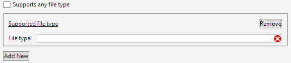

# MigrationE2E-MD1
###Content hahaha

Reference topic: [F# Guide](~/SimpleMDExport/visual-fsharp-guided-tour.md)    

Reference token: [!INCLUDE[MigrationE2E-token-normal](../includes/migratione2e-token-normal.md)]

Reference image:     

Reference CodeSnippet: [!code-csharp[buttongroup](../samples/snippets/csharp/VS_Snippets_VSSDK/buttongroup/cs/buttongrouppackage.cs#21)]

###Conmplex token:
[!INCLUDE[MrigrationE2E-token-complex](../includes/mrigratione2e-token-complex.md)]
